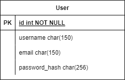

# Cosmos Transfer

### Installation
A docker installation is needed to execute the project. You can check more information about the installation in [docker website](www.docker.com/).

### Project structure
`.envs - Environments variables`

```
app - Main directory

    static - Statics files

    templates - HTML templates

    models - Models definition

    routes - Routes definition
```

`compose - Docker compose files`


`migrations - Flask migrations to create database tables`

`config.py - Project configuration`

`requirements.txt - Project requirements`

`run.py - Project entrypoint`

### Entity Relationship Diagram


### Execution
Create container:
```
$ docker compose build
```

If it's the first time you're running the project, you'll need to generate the database running the following command:
```
$ docker compose run --rm flask flask db upgrade
```

Afterward, you can execute the code with the following command:
```
$ docker compose up
```

At this point, you can access the website by going to [http://localhost:5000](localhost) in your browser.

Once the development is finished, the project should be compressed into a zip file.